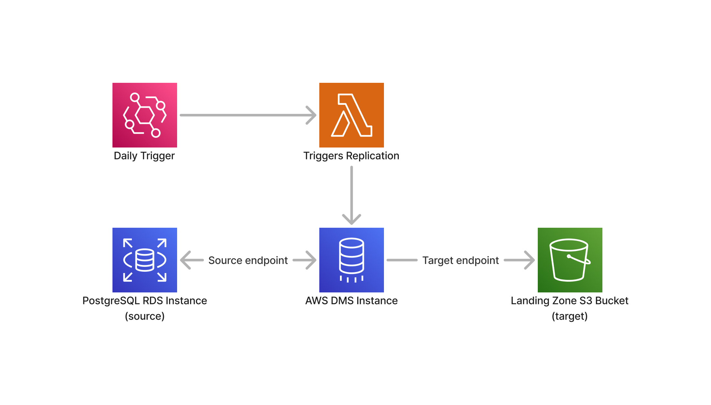

# AWS DMS Batch Data Ingestion Setup

This repository contains the necessary configurations and code to set up an automated batch data ingestion pipeline using AWS DMS, AWS Lambda, and AWS CDK. This setup will enable the ingestion of data from a PostgreSQL RDS instance to an Amazon S3 bucket on a daily schedule.

This is a supporting material to my blog post entitled, Streamlined Batch Data Ingestion with AWS Data Migration Service (DMS), Amazon EventBridge, and AWS Lambda
